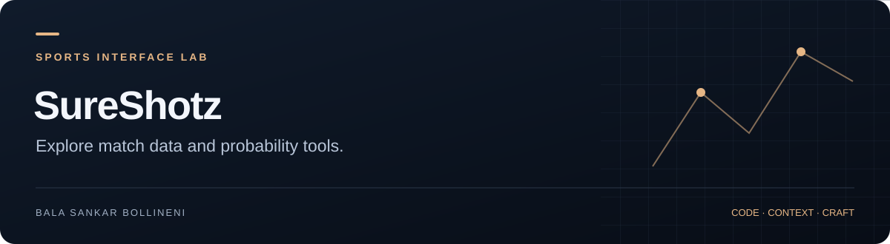

**[Project guide](docs/SHOWCASE.md)** · [Source](https://github.com/BalaShankar9/SureShotz) · [Issues](https://github.com/BalaShankar9/SureShotz/issues) · [Bala's work](https://github.com/BalaShankar9)

> **Current stage:** Frontend prototype · provider setup required. [See the evidence and next release checklist](docs/SHOWCASE.md).

# SureShotz

A React, TypeScript and Vite sports-data prototype. The current application entry point renders **UpcomingMatches**; the repository also contains experimental prediction, parlay, Monte Carlo, hedging and bankroll components.

## Current scope

| Area | Status in source |
| --- | --- |
| Upcoming matches | Mounted by [src/App.tsx](src/App.tsx) |
| Other screens | Components exist; they are not all connected to the current entry point |
| Sports providers | API-Sports and Odds API service integrations exist |
| Persistence | Supabase client and database types exist; migrations are not included |
| Simulation | The sports data service can fall back to synthetic matches on error or empty data |

Synthetic match data is for development. It must not be presented as observed live data or evidence of prediction performance.

## Local development

```bash
git clone https://github.com/BalaShankar9/SureShotz.git
cd SureShotz
npm ci
cp .env.example .env.local
# Configure your development services.
npm run dev
```

The Supabase schema and provider access must be supplied separately. The example environment file contains placeholders only. Vite exposes `VITE_*` values to the browser; use only a Supabase public/anon key there. Secret sports-provider keys need a server-side proxy before public deployment.

## Checks available

```bash
npm run typecheck
npm run lint
npm run build
```

These scripts are declared in [package.json](package.json). No automated test suite or CI workflow is currently included.

## Explore the code

- [Current screen](src/components/UpcomingMatches.tsx)
- [Calculation utilities](src/utils)
- [Provider services](src/services)
- [Database types](src/types/database.ts)

See the [project guide](docs/SHOWCASE.md) for the path from prototype to a reproducible demo.
